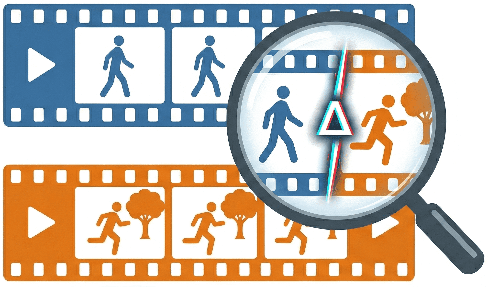
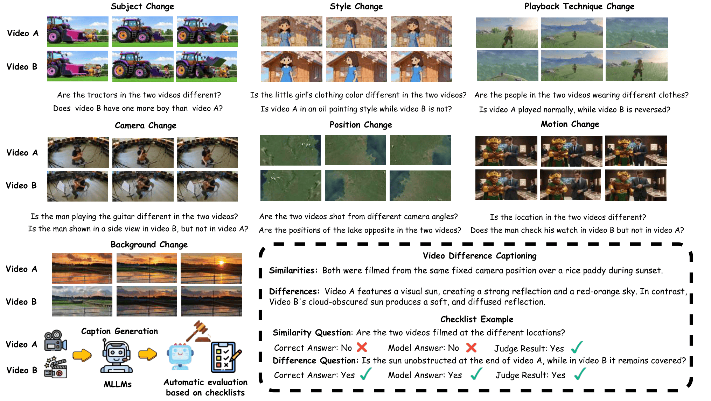
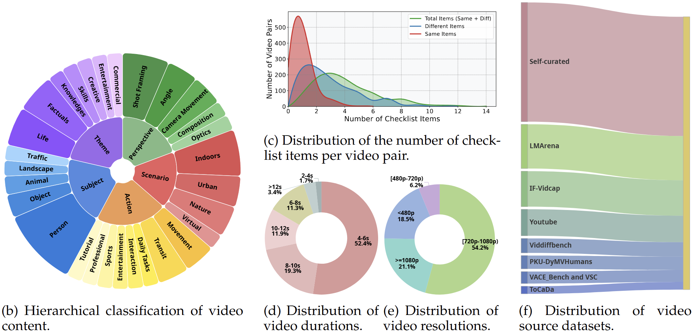

<div align="center">
  <h1>
    <br>
    ViDiC: Video Difference Captioning
  </h1>
  
  <p align="center">
    <a href="https://github.com/NJU-LINK/ViDiC-1K"></a>
    <a href="https://arxiv.org/abs/2512.03405"></a>
    <a href="https://vidic-1k.github.io/"></a>
    <a href="https://huggingface.co/datasets/NJU-LINK/ViDiC-1K"></a>
  </p>

  <p align="center">
    <a href="README.md">English</a> | <a href="README_zh.md">中文</a>
  </p>
</div>

---

## 📋 Abstract

Understanding visual differences between dynamic scenes requires the comparative perception of compositional, spatial, and temporal changes—a capability that remains underexplored in existing vision-language systems. While prior work on Image Difference Captioning (IDC) has enabled models to describe semantic changes between static images, these approaches fail to capture motion continuity, event evolution, or editing consistency over time.

To address this, we introduce **ViDiC (Video Difference Captioning)**, a new task that extends difference captioning into the video domain. We present the **ViDiC-1K** benchmark, designed to evaluate the ability of Multimodal Large Language Models (MLLMs) to provide fine-grained descriptions of similarities and differences between video pairs. This formulation moves beyond traditional video similarity or video editing metrics, focusing instead on **edit understanding** rather than edit execution.

<p align="center">
  
  <br>
  <em>Figure 1: Illustration of the ViDiC task. A model must generate captions detailing similarities and differences across seven categories, assessed against a fine-grained checklist.</em>
</p>

## 🌟 Key Features

- **🎥 First Video Difference Captioning Benchmark**: A unified task requiring descriptive, comparative, and temporal understanding of video pairs.
- **📝 ViDiC-1K Dataset**: 1,000 curated video pairs annotated with 3720 comparative checklist items.
- **🔍 Dual-Checklist Evaluation**: A rigorous framework evaluating **Similarity** (checking for hallucinations) and **Difference** (checking for perception) separately.
- **🤖 Scalable LLM-as-a-Judge**: An automated, interpretable evaluation protocol using GPT-5-Mini to quantify factual accuracy against human-verified ground truths.

## 📈 Benchmark Statistics

<p align="center">
  
</p>

- **Total Pairs**: 1,000 (Real & Synthetic)
- **Evaluation Dimensions**: 7 Categories (Subject, Style, Background, Camera, Motion, Position, Playback Technique)
- **Video Duration**: Primarily 2-12 seconds
- **Data Sources**: Curated from 8+ public datasets (e.g., VidDiffBench, LMArena) and self-generated synthetic data (Veo3 + frame splicing).

## 📰 News
- 🤗 ViDiC-1K Dataset is available on Hugging Face.
- 🚀 Evaluation code and leaderboards is released.

## 📂 File Structure

```
ViDiC/
├── assets/ # Images for README
│   ├── page.png
│   └── stats.png
│
├── checklist/  # The annotion file
│   └── checklist.json
│
├── data/   # Video files  Get from the hugging face
|  
|
├── inference/   # Inference scripts for popular models
│   ├── get_response_GLM.py
│   ├── get_response_gemini.py
|   └── ......
|
├── judge/   # judge with gpt5-mini
│   ├── judge.py
│
├── prompt/
│   ├── prompt_get_response.txt
│   └── prompt_judge.txt
│
├── response/
│   └── example_response.json
│
└── utils/
    └── calculate.py # get the score
```

## 📊 Benchmark Results
### Overall Model Performance

## 📊 Benchmark Results
### Overall Model Performance

| Model | Param. | Avg. | Diff. | Sim. | Subject | Motion | Pos. | Backgr. | Cam. | Style | Tech. |
| :--- | :---: | ---: | ---: | ---: | ---: | ---: | ---: | ---: | ---: | ---: | ---: |
| **Human** 🧠 | - | 94.46 | 92.99 | 98.57 | 96.36 | 94.36 | 90.14 | 96.70 | 92.90 | 82.31 | 97.18 |
| **_Closed-Source_** |
| Gemini-2.5-Pro | 🔒 | **69.33** | **66.84** | 76.27 | **71.95** | **61.71** | **70.42** | **75.47** | 60.41 | 79.27 | **66.20** |
| Gemini-3.0-Flash | 🔒 | 65.81 | 60.04 | 81.87 | 66.17 | 57.78 | 68.31 | 69.31 | **63.88** | 77.44 | 61.97 |
| Gemini-2.5-Flash | 🔒 | 63.73 | 57.87 | 80.04 | 66.60 | 56.92 | 64.79 | 66.12 | 58.99 | **81.71** | 42.25 |
| GPT-5 | 🔒 | 62.26 | 62.03 | 62.90 | 62.63 | 56.79 | 68.05 | 74.03 | 49.75 | 61.18 | 40.62 |
| **_Open-Source_** |
| Qwen3-VL | 32B | 63.90 | 62.75 | 67.11 | 66.64 | 55.38 | 69.01 | 70.30 | 58.20 | 62.20 | 45.07 |
| Qwen3-VL 💡 | 8B | 57.57 | 49.43 | 80.24 | 59.70 | 48.03 | 59.86 | 62.27 | 54.73 | 71.95 | 26.76 |
| Qwen3-VL | 8B | 55.75 | 50.99 | 69.04 | 56.76 | 46.84 | 58.45 | 64.91 | 49.21 | 62.20 | 29.58 |
| InternVL-3.5 💡 | 38B | 53.62 | 47.64 | 70.26 | 54.48 | 43.42 | 53.17 | 64.36 | 49.21 | 54.27 | 26.76 |
| Mimo-VL-SFT 💡 | 7B | 51.26 | 41.20 | 79.33 | 51.72 | 39.32 | 49.30 | 55.78 | 53.31 | 71.95 | 26.76 |
| Qwen2.5-VL-Instruct | 72B | 46.22 | 38.04 | 69.01 | 45.00 | 35.10 | 47.54 | 53.74 | 45.34 | 62.80 | 23.94 |
| InternVL-3.5 | 38B | 45.85 | 36.83 | 70.98 | 45.11 | 40.00 | 45.94 | 51.71 | 42.74 | 61.59 | 21.13 |
| InternVL-3.5 💡 | 8B | 45.78 | 37.80 | 68.02 | 46.23 | 33.68 | 46.48 | 53.14 | 42.74 | 66.46 | 21.13 |
| Qwen2.5-VL-Instruct | 32B | 45.30 | 35.55 | 72.48 | 45.28 | 35.62 | 46.83 | 52.53 | 43.92 | 52.44 | 22.54 |
| Keye-VL-1.5 💡 | 8B | 45.24 | 30.94 | 85.12 | 43.99 | 35.89 | 45.55 | 50.72 | 45.76 | 63.98 | 21.43 |
| Mimo-VL-SFT | 7B | 43.09 | 33.27 | 70.47 | 45.67 | 32.82 | 43.31 | 44.88 | 45.58 | 51.83 | 22.54 |
| Qwen2.5-VL-Instruct | 7B | 38.68 | 25.90 | 74.31 | 35.95 | 32.53 | 35.21 | 41.52 | 43.44 | 57.32 | 22.54 |
| InternVL-3.5 | 8B | 38.18 | 29.34 | 62.83 | 39.33 | 30.48 | 38.03 | 43.89 | 33.12 | 54.88 | 18.31 |
| Keye-VL-1.5 | 8B | 38.12 | 28.94 | 63.74 | 38.51 | 31.53 | 34.52 | 43.72 | 35.52 | 51.55 | 21.43 |
| GLM-4.1V 💡 | 9B | 36.51 | 29.04 | 57.33 | 38.30 | 30.94 | 33.10 | 40.81 | 34.38 | 41.46 | 21.13 |
| Kimi-VL-A3B 💡 | 16B | 34.82 | 21.23 | 72.71 | 33.21 | 28.03 | 31.34 | 35.97 | 40.69 | 52.44 | 21.13 |
| InternVideo2.5 | 7B | 34.18 | 16.95 | 82.26 | 29.76 | 30.60 | 32.75 | 33.00 | 42.74 | 57.32 | 21.13 |
| LLaVA-V1.6-Vicuna | 7B | 25.19 | 0.58 | **93.79** | 17.89 | 25.98 | 22.18 | 17.16 | 43.69 | 49.39 | 22.54 |
| ViDiC-Qwen (Ours) | 7B | 50.43 | 41.72 | 74.69 | 50.37 | 38.70 | 52.11 | 57.38 | 48.73 | 68.10 | 26.76 |


*Note: **Diff.** measures perception of changes; **Sim.** checks for hallucinations (inverse accuracy). MLLMs generally struggle with Camera and Playback Techniques.*

**Key Findings**
1. 📉 Significant Gaps: Describing temporal differences (Motion, Camera) is much harder than static attributes (Style, Subject).
2. ⚖️ Trade-off: "Thinking" models improve Difference detection but often hallucinate differences in identical areas (lower Similarity score).
3. 🚧 Critical Weakness: Almost all models fail significantly on Camera works and Playback Techniques (e.g., reverse, slow-motion).

## 📝 Citation

If you find ViDiC useful in your research, please consider citing our paper:

```bibtex
@misc{wu2025vidicvideodifferencecaptioning,
      title={ViDiC: Video Difference Captioning}, 
      author={Jiangtao Wu and Shihao Li and Zhaozhou Bian and Yuanxing Zhang and Jialu Chen and Runzhe Wen and An Ping and Yiwen He and Jiakai Wang and Jiaheng Liu},
      year={2025},
      eprint={2512.03405},
      archivePrefix={arXiv},
      primaryClass={cs.CV},
      url={https://arxiv.org/abs/2512.03405}, 
    }
```

## 📄 License
Our dataset is released under the CC-BY-NC-SA-4.0 license.

## 📧 Contact
For questions and feedback:

- 🐛 Issues: GitHub Issues
- 💬 Discussions: Hugging Face Discussions

