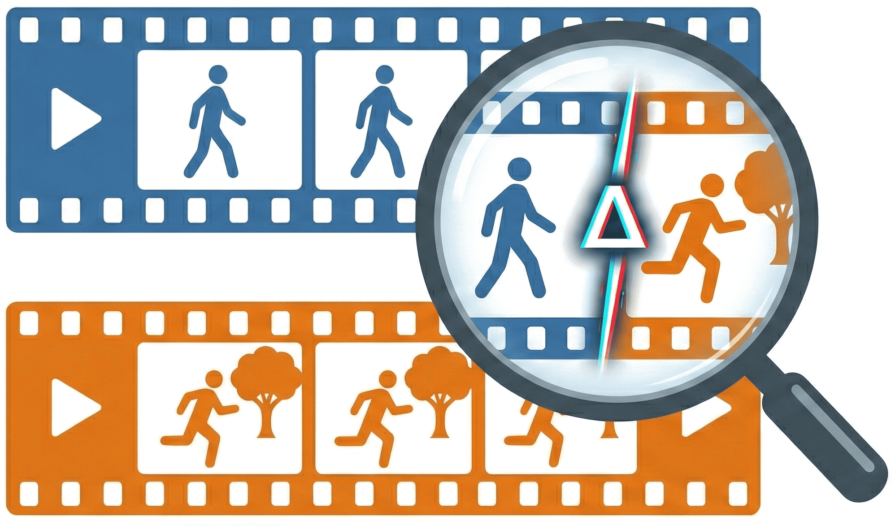

<div align="center">
  <h1>
  <br>
    ViDiC: 视频差异描述 (Video Difference Captioning)
  </h1>
  
  <p align="center">
    <a href="https://github.com/NJU-LINK/ViDiC-1K"></a>
    <a href="https://arxiv.org/abs/2512.03405"></a>
    <a href="https://vidic-1k.github.io/"></a>
    <a href="https://huggingface.co/datasets/NJU-LINK/ViDiC-1K"></a>
  </p>

  <p align="center">
    <a href="README.md">English</a> | <a href="README_zh.md">中文</a>
  </p>
</div>

---

## 📋 摘要

理解动态场景之间的视觉差异，需要对构成要素、空间位置以及时间维度的变化进行对比感知——这在现有的视觉-语言系统中仍是一个未被充分探索的能力。虽然先前的图像差异描述 (Image Difference Captioning, IDC) 工作使模型能够描述静态图像之间的语义变化，但这些方法无法捕捉动作的连续性、事件的演变或随时间变化的编辑一致性。

为了解决这个问题，我们推出了 **ViDiC (Video Difference Captioning)**，这是一项将差异描述扩展到视频领域的新任务。我们要介绍了 **ViDiC-1K** 基准测试，旨在评估多模态大语言模型 (MLLMs) 对视频对之间的相似点和不同点进行细粒度描述的能力。这一设定超越了传统的视频相似度或视频编辑指标，将重点放在了**对编辑的理解**而非编辑的执行上。

<p align="center">
  
  <br>
  <em>图 1: ViDiC 任务示意图。模型必须生成涵盖七个类别的相似性和差异性详细描述，并对照细粒度的检查清单进行评估。</em>
</p>

## 🌟 主要特性

- **🎥 首个视频差异描述基准**: 一个统一的任务，要求对视频对进行描述性、对比性和时间性的理解。
- **📝 ViDiC-1K 数据集**: 精选的 1,000 个视频对，包含超过 4,000 个用于对比的检查清单条目 (checklist items)。
- **🔍 双重清单评估 (Dual-Checklist Evaluation)**: 一个严格的评估框架，分别评估**相似性** (检查是否产生幻觉) 和**差异性** (检查感知能力)。
- **🤖 可扩展的大模型裁判 (LLM-as-a-Judge)**: 一个自动化、可解释的评估协议，使用 GPT-5-Mini 对照经过人工验证的真值 (Standard Ground Truth) 来量化事实准确性。

## 📈 基准统计

<p align="center">
  
</p>

- **视频对总数**: 1,000 (真实场景 & 合成数据)
- **检查清单条目总数**: ~4,100 (1,056 相似性条目 / 3,051 差异性条目)
- **评估维度**: 7 个类别 (主体、风格、背景、运镜、动作、位置、播放技术)
- **视频时长**: 主要集中在 2-12 秒
- **数据来源**: 筛选自 8 个以上的公共数据集 (如 VidDiffBench, LMArena) 以及自生成的合成数据 (Veo3 + 帧拼接)。

## 📰 最新动态
- 🤗 ViDiC-1K 数据集已经在 Hugging Face 上线。
- 🚀 评估代码和排行榜已发布。

## 📂 文件结构
```
ViDiC/
├── assets/ # Images for README
│   ├── page.png
│   └── stats.png
│
├── checklist/  # The annotion file
│   └── checklist.json
│
├── data/   # Video files  Get from the hugging face
│   └── LMArena
|   └── style
|   └── ......
|
├── inference/   # Inference scripts for popular models
│   ├── get_response_GLM.py
│   ├── get_response_gemini.py
|   └── ......
|
├── judge/   # judge with gpt5-mini
│   ├── judge.py
│
├── prompt/
│   ├── prompt_get_response.txt
│   └── prompt_judge.txt
│
├── response/
│   └── example_response.json
│
└── utils/
    └── calculate.py # get the score
```

## 📊 基准测试结果
### 总体模型表现
| Model | Param. | Avg. | Diff. | Sim. | Subject | Motion | Pos. | Backgr. | Cam. | Style | Tech. |
| :--- | :---: | ---: | ---: | ---: | ---: | ---: | ---: | ---: | ---: | ---: | ---: |
| **_闭源模型_** | | | | | | | | | | | |
| Gemini-2.5-Pro | 🔒 | 66.72 | 63.73 | 75.33 | 67.71 | 62.78 | 68.24 | 70.65 | 59.97 | 75.79 | 74.32 |
| GPT-5 | 🔒 | 62.94 | 57.32 | 79.17 | 61.52 | 57.78 | 65.31 | 69.15 | 57.39 | 77.60 | 54.66 |
| Gemini-2.5-Flash | 🔒 | 58.87 | 52.11 | 78.37 | 59.63 | 51.29 | 57.23 | 63.98 | 52.82 | 81.58 | 55.41 |
| Gemini-2.0-Flash | 🔒 | 53.71 | 50.26 | 63.66 | 58.90 | 48.71 | 57.86 | 57.11 | 47.30 | 55.79 | 18.92 |
| GPT-4o | 🔒 | 49.95 | 39.14 | 81.12 | 46.79 | 43.53 | 51.89 | 53.73 | 49.18 | 77.89 | 27.03 |
| **_开源模型_** | | | | | | | | | | | |
| Qwen3-VL | 32B | 61.38 | 58.54 | 71.50 | 64.60 | 51.77 | 62.00 | 68.62 | 52.66 | 74.86 | 47.83 |
| Qwen3-VL | 8B | 53.23 | 50.44 | 63.20 | 58.66 | 43.33 | 52.33 | 63.49 | 40.92 | 66.28 | 11.59 |
| Mimo-VL-SFT | 7B | 52.59 | 46.51 | 70.17 | 54.39 | 46.55 | 51.25 | 57.31 | 48.37 | 67.71 | 25.33 |
| InternVL-3.5 💡 | 38B | 52.44 | 46.25 | 70.30 | 52.66 | 43.04 | 53.77 | 59.80 | 47.80 | 72.63 | 20.27 |
| InternVL-3.5 | 38B | 50.49 | 40.09 | 80.46 | 48.35 | 44.34 | 51.89 | 54.93 | 49.18 | 76.32 | 14.86 |
| Qwen2.5-VL-Instruct | 72B | 49.71 | 42.56 | 70.30 | 48.07 | 44.82 | 48.11 | 55.92 | 46.42 | 68.95 | 22.97 |
| Qwen2.5-VL-Instruct | 32B | 47.83 | 43.42 | 60.53 | 49.72 | 40.78 | 49.69 | 55.12 | 38.39 | 68.42 | 20.27 |
| InternVL-3.5 💡 | 8B | 45.01 | 41.18 | 56.07 | 46.79 | 37.06 | 45.60 | 54.03 | 35.76 | 61.58 | 17.57 |
| InternVL-3.5 | 8B | 43.67 | 35.68 | 66.70 | 43.21 | 37.54 | 45.60 | 48.46 | 39.02 | 68.42 | 14.86 |
| GLM-4.1V 💡 | 9B | 40.95 | 33.99 | 61.08 | 42.60 | 34.35 | 38.13 | 47.26 | 33.83 | 64.58 | 14.67 |
| Qwen2.5-VL-Instruct | 7B | 39.39 | 35.22 | 51.42 | 39.82 | 33.82 | 37.42 | 47.96 | 30.74 | 58.95 | 14.86 |
| Kimi-VL-A3B 💡 | 16B | 35.16 | 28.68 | 53.88 | 37.48 | 26.00 | 35.63 | 42.99 | 22.56 | 70.31 | 14.67 |
| InternVideo2.5 | 7B | 32.70 | 23.14 | 60.32 | 32.72 | 23.43 | 33.13 | 36.42 | 28.70 | 66.15 | 14.67 |
| Keye-VL-1.5 | 8B | 32.45 | 25.53 | 57.13 | 32.86 | 25.80 | 30.67 | 39.18 | 24.69 | 60.00 | 8.70 |
| Llama-3.2 | 11B | 19.43 | 5.23 | 61.01 | 14.48 | 20.31 | 17.84 | 13.44 | 29.56 | 40.00 | 11.70 |
| LLaVA-V1.6-Vicuna | 7B | 8.96 | 5.11 | 20.07 | 7.49 | 12.20 | 13.44 | 6.96 | 10.02 | 6.25 | 6.67 |

*注：**Diff.** 衡量对变化的感知能力；**Sim.** 用于检查幻觉（准确率的逆反）。多模态大模型普遍在运镜 (Camera) 和播放技术 (Technique) 方面表现挣扎。*

**主要发现**

1. 📉 显著差距：描述时间上的差异（如动作、运镜）比描述静态属性（如风格、主体）要困难得多。
2. ⚖️ 权衡取舍：具有思维链（"Thinking"）能力的模型在差异检测上有所提升，但往往会在相同的区域产生差异幻觉（导致 Sim. 分数较低）。
3. 🚧 关键弱点：几乎所有模型在播放技术（例如倒放、慢动作）这一项上都严重失效。

## 📝 引用
如果您觉得 ViDiC 对您的研究有帮助，请考虑引用我们的论文：

```bibtex
  @misc{wu2025vidicvideodifferencecaptioning,
        title={ViDiC: Video Difference Captioning}, 
        author={Jiangtao Wu and Shihao Li and Zhaozhou Bian and Yuanxing Zhang and Jialu Chen and Runzhe Wen and An Ping and Yiwen He and Jiakai Wang and Jiaheng Liu},
        year={2025},
        eprint={2512.03405},
        archivePrefix={arXiv},
        primaryClass={cs.CV},
        url={https://arxiv.org/abs/2512.03405}, 
  }
```

## 📄 许可协议
我们的数据集根据 CC-BY-NC-SA-4.0 许可证发布。

## 📧 联系方式
如有问题或反馈：

- 🐛 问题反馈: GitHub Issues
- 💬 讨论: Hugging Face Discussions
