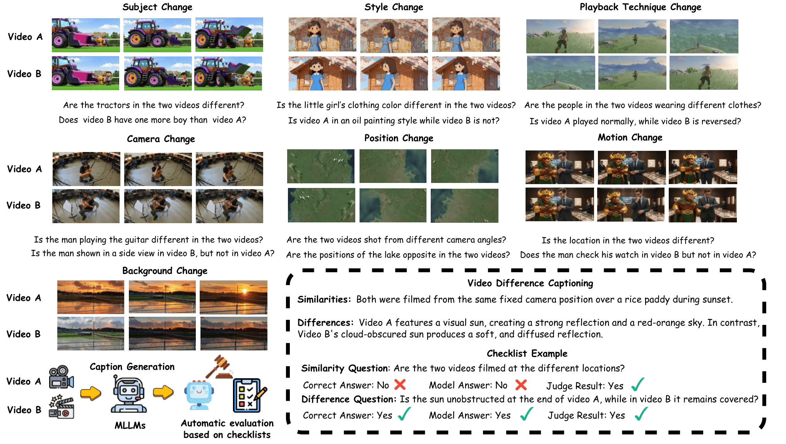

<div align="center">
  <h1>
    ViDiC: Video Difference Captioning
  </h1>
  
  <p align="center">
    <a href="https://github.com/YourOrg/ViDiC"></a>
    <a href="https://arxiv.org/abs/YourArxivID"></a>
    <a href="https://vidic-project.github.io/"></a>
    <a href="https://huggingface.co/datasets/YourOrg/ViDiC-1K"></a>
  </p>

  <p align="center">
    <a href="README.md">English</a> | <a href="README_zh.md">中文</a>
  </p>
</div>

---

## 📋 Abstract

Understanding visual differences between dynamic scenes requires the comparative perception of compositional, spatial, and temporal changes—a capability that remains underexplored in existing vision-language systems. While prior work on Image Difference Captioning (IDC) has enabled models to describe semantic changes between static images, these approaches fail to capture motion continuity, event evolution, or editing consistency over time.

To address this, we introduce **ViDiC (Video Difference Captioning)**, a new task that extends difference captioning into the video domain. We present the **ViDiC-1K** benchmark, designed to evaluate the ability of Multimodal Large Language Models (MLLMs) to provide fine-grained descriptions of similarities and differences between video pairs. This formulation moves beyond traditional video similarity or video editing metrics, focusing instead on **edit understanding** rather than edit execution.

<p align="center">
  
  <br>
  <em>Figure 1: Illustration of the ViDiC task. A model must generate captions detailing similarities and differences across seven categories, assessed against a fine-grained checklist.</em>
</p>

## 🌟 Key Features

- **🎥 First Video Difference Captioning Benchmark**: A unified task requiring descriptive, comparative, and temporal understanding of video pairs.
- **📝 ViDiC-1K Dataset**: 1,000 curated video pairs annotated with over 4,000 comparative checklist items.
- **🔍 Dual-Checklist Evaluation**: A rigorous framework evaluating **Similarity** (checking for hallucinations) and **Difference** (checking for perception) separately.
- **🤖 Scalable LLM-as-a-Judge**: An automated, interpretable evaluation protocol using GPT-5-Mini to quantify factual accuracy against human-verified ground truths.

## 📈 Benchmark Statistics

<p align="center">
  
</p>

- **Total Pairs**: 1,000 (Real & Synthetic)
- **Total Checklist Items**: ~4,100 (1,056 Similarity / 3,051 Difference)
- **Evaluation Dimensions**: 7 Categories (Subject, Style, Background, Camera, Motion, Position, Playback Technique)
- **Video Duration**: Primarily 2-12 seconds
- **Data Sources**: Curated from 8+ public datasets (e.g., VidDiffBench, LMArena) and self-generated synthetic data (Veo3 + frame splicing).

## 📰 News
- **[Current Date]** 📝 Paper submitted to CVPR 2026.
- **[Coming Soon]** 🤗 ViDiC-1K Dataset will be available on Hugging Face.
- **[Coming Soon]** 🚀 Evaluation code and leaderboards will be released.

## 🚀 Quick Start

### Installation

```bash
git clone https://github.com/YourOrg/ViDiC.git
cd ViDiC
pip install -r requirements.txt
```

### 🤗 Download Dataset
```bash
# Using huggingface-cli
hf download YourOrg/ViDiC-1K --local-dir ./data/ViDiC-1K --include-pattern "*.mp4"
``` 

### Evaluation
We provide scripts to run the Dual-Checklist evaluation using the LLM-as-a-Judge protocol.

```bash

```

## 📂 File Structure

```
ViDiC/
├── data/           # Video files and annotations
│   ├── videos/           
│   └── annotations/
│       ├── vidic_1k_checklists.json  # Ground truth Q&A
│       └── video_meta.json
├── evaluation/     # Evaluation scripts
│   ├── judge_prompts/      # Prompts for LLM judge
│   └── metric_calc.py      
├── inference/      # Inference scripts for popular models
│   ├── qwen_vl.py       
│   ├── gpt4o.py
│   └── ...
├── assets/         # Images for README
└── main_results.py # Script to reproduce paper tables
```

## 📊 Benchmark Results
### Overall Model Performance

*Note: **Diff.** measures perception of changes; **Sim.** checks for hallucinations (inverse accuracy). MLLMs generally struggle with Camera and Playback Techniques.*

**Key Findings**
1. 📉 Significant Gaps: Describing temporal differences (Motion, Camera) is much harder than static attributes (Style, Subject).
2. ⚖️ Trade-off: "Thinking" models improve Difference detection but often hallucinate differences in identical areas (lower Similarity score).
3. 🚧 Critical Weakness: Almost all models fail significantly on Playback Techniques (e.g., reverse, slow-motion).

## 📝 Citation

If you find ViDiC useful in your research, please consider citing our paper:

```bibtex

```

## 📄 License
Our dataset is released under the CC-BY-NC-SA-4.0 license.

## 📧 Contact
For questions and feedback:

- 🐛 Issues: GitHub Issues
- 💬 Discussions: Hugging Face Discussions

